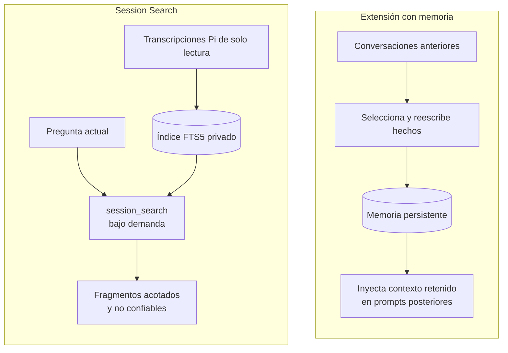
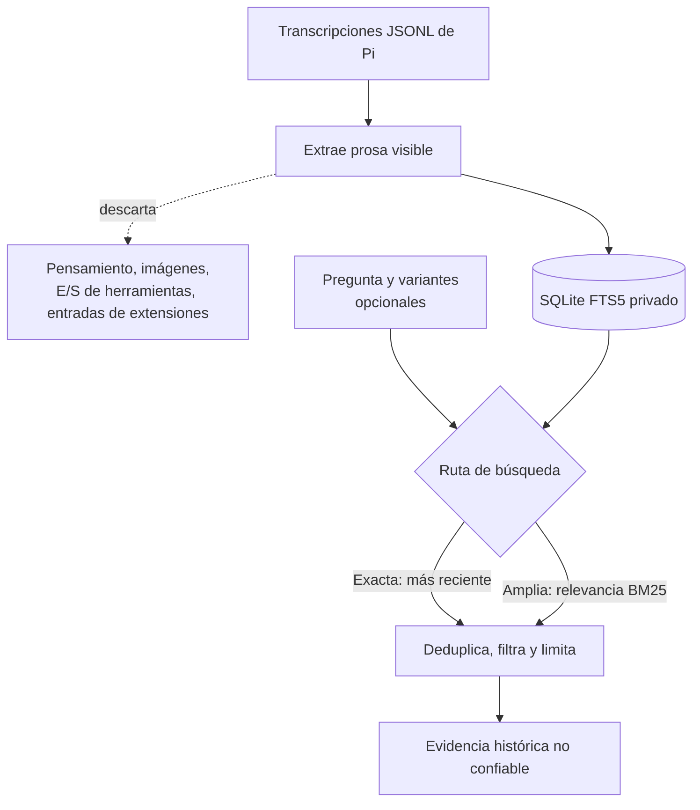

<p align="center">
  <picture>
    <source media="(prefers-color-scheme: dark)" srcset="docs/assets/session-search-title-dark.svg">
    <source media="(prefers-color-scheme: light)" srcset="docs/assets/session-search-title-light.svg">
    
  </picture>
</p>

<p align="center">🇬🇧 <a href="README.md">English</a> &nbsp;·&nbsp; 🇪🇸 <b>Español</b></p>

# Session Search

**¿Por qué inyectar memoria en cada sesión de Pi cuando puedes buscar el historial bajo demanda?**

Las extensiones centradas en memoria resuelven un problema real, pero distinto.
Conservan hechos, preferencias, resúmenes o instrucciones seleccionados para
trabajos futuros. Eso resulta útil cuando el material retenido debe influir en
cada sesión pertinente. No es la mejor opción predeterminada si solo quieres
responder preguntas como "¿Qué decidimos sobre la migración?" o "¿Dónde
corregimos esto antes?"

Tu agente no debería arrastrar historial sin relación hacia cada tarea nueva.

La memoria persistente tiene que decidir qué merece sobrevivir, mantener ese
material actualizado y decidir cuándo devolverlo al prompt. Una mala decisión
en cualquiera de esos pasos puede gastar contexto en hechos sin relación,
llevar conclusiones obsoletas a trabajo nuevo o hacer que una conversación
anterior parezca una instrucción vigente. Los almacenes de memoria más grandes
también consumen espacio del prompt antes de que el agente demuestre que la
tarea actual los necesita.

Session Search adopta un enfoque más acotado. No crea memorias persistentes,
bancos de contexto, skills generadas ni inyección automática de contexto.
Construye un índice SQLite FTS5 privado y reconstruible a partir de la prosa
visible en transcripciones JSONL locales de Pi. Las transcripciones siguen
siendo de solo lectura y son la fuente de verdad.

Un índice no es contexto. El texto histórico llega al modelo solo cuando el
agente llama `session_search`, y cada resultado está acotado y marcado como
evidencia histórica no confiable.

### Dos formas de reutilizar el historial



Las herramientas centradas en memoria pueden incorporar material retenido a
prompts futuros antes de que la tarea actual demuestre que es pertinente.
Session Search mantiene las transcripciones y el índice fuera del prompt hasta
que el agente solicita evidencia específica.

| | Extensiones con memoria | Session Search |
|---|---|---|
| Tarea principal | Llevar conocimiento seleccionado a trabajos futuros | Recuperar evidencia de conversaciones anteriores cuando se solicita |
| Comportamiento del prompt | Puede añadir material retenido de forma proactiva | No añade nada hasta ejecutar `session_search` |
| Representación almacenada | Hechos, resúmenes, preferencias o instrucciones persistentes | Índice léxico reconstruible de la prosa de las transcripciones |
| Fuente de verdad | Una capa de memoria curada que debe mantenerse actualizada | Transcripciones Pi originales y de solo lectura |
| Cobertura | Lo que el proceso de memoria decidió conservar | Prosa indexada del usuario, asistente y sistema |
| Control de resultados | Depende de la política de inyección de memoria | Proyecto, rol, fecha, cantidad de resultados, tamaño de fragmento y límite total |

Esto convierte a Session Search en una mejor opción predeterminada para
recordar conversaciones. Obtienes la parte útil, encontrar qué ocurrió antes,
sin convertir cada conversación anterior en contexto permanente para la
siguiente.

### De la transcripción a evidencia acotada



La extensión escribe únicamente su índice reconstruible. No reescribe las
transcripciones fuente, no crea memorias, no llama a un servicio de traducción
ni añade resultados de búsqueda al prompt sin una llamada a `session_search`.

El límite está aplicado en el código. Los bloques de pensamiento, imágenes,
argumentos y resultados de herramientas, y entradas de extensiones quedan fuera
del índice. Una llamada devuelve como máximo 20 resultados, limita cada
fragmento a entre 100 y 4.000 caracteres y limita la salida total a 50 KiB. Las
coincidencias exactas mantienen el orden de la más reciente a la más antigua. El
`fallback` léxico más amplio usa relevancia BM25. El agente también puede
proporcionar hasta tres traducciones al idioma fuente o paráfrasis de palabras
clave, pero Session Search no realiza traducciones, llamadas de red ni llamadas
adicionales al modelo.

En un corpus privado congelado de 528 sesiones válidas y 9.023 mensajes
visibles, Session Search alcanzó 92,5% de Rank@1 y 100% de Recall@10 en 40
consultas deterministas de elementos conocidos. La latencia p95 del motor
persistente fue de 1,16 ms. Consulta [docs/benchmark.md](docs/benchmark.md) para
ver la metodología y sus limitaciones.

## Contrato de ejecución

- `session_search` busca fragmentos acotados en el historial.
- `queryVariants` acepta hasta tres traducciones al idioma fuente o paráfrasis
  de palabras clave proporcionadas por el agente. Las variantes se buscan
  primero, y los resultados se intercalan y deduplican por sesión.
- `/session-index` reconcilia y actualiza incrementalmente el índice local.
- El inicio ejecuta un backfill incremental acotado.
- La indexación en vivo sigue los mensajes finalizados.
- El cierre completa la indexación pendiente y cierra SQLite.
- Los resultados de las transcripciones se marcan como evidencia histórica no
  confiable.

Se indexa de forma predeterminada:

- prosa del usuario
- prosa visible del asistente
- prosa del sistema
- proyecto, directorio de trabajo, fecha, rol y nombres de herramientas como
  metadatos

Se excluye de forma predeterminada:

- bloques de pensamiento
- imágenes y base64
- argumentos y resultados de herramientas
- entradas personalizadas de extensiones

## Instalación

Session Search se instala actualmente desde GitHub:

```bash
pi install git:github.com/felores/pi-session-search
```

Reinicia Pi o ejecuta `/reload`, luego construye el índice inicial:

```text
/session-index
```

Pregunta normalmente a Pi sobre conversaciones anteriores. El agente puede
llamar `session_search` con `queryVariants` opcionales en el idioma fuente
cuando la pregunta actual y la conversación histórica podrían usar idiomas
distintos.

La extensión lee las transcripciones JSONL de Pi sin modificarlas. El estado
generado permanece en `~/.pi/agent/session-search/` con permisos privados del
sistema de archivos.

## Desarrollo local

```bash
npm install
npm run hooks:install # hook opcional para colaboradores
npm run quality
pi -e ./src/index.ts
```

El estado generado usa `~/.pi/agent/session-search/index.sqlite` de forma
predeterminada. Sobrescribe el directorio de almacenamiento con
`PI_SESSION_SEARCH_DIR` y la raíz de las transcripciones con
`PI_CODING_AGENT_SESSION_DIR`.

No habilites Session Search globalmente junto a otra extensión que ya registre
`session_search`; Pi añadirá sufijos a los nombres duplicados de herramientas y
comandos. Durante una migración, valida este checkout con
`pi -e ./src/index.ts` y cambia el paquete global solo después de que el índice
de reemplazo supere sus pruebas.

## Estado

La primera versión admite sesiones JSONL de Pi. La abstracción normalizada de
fuentes queda reservada para un futuro adaptador SQLite de OpenCode en modo de
solo lectura.

## Licencia y origen

MIT. Algunas partes del parser y del comportamiento de búsqueda derivan de
[`pi-hermes-memory`](https://github.com/chandra447/pi-hermes-memory). Consulta
[ATTRIBUTION.md](ATTRIBUTION.md).
