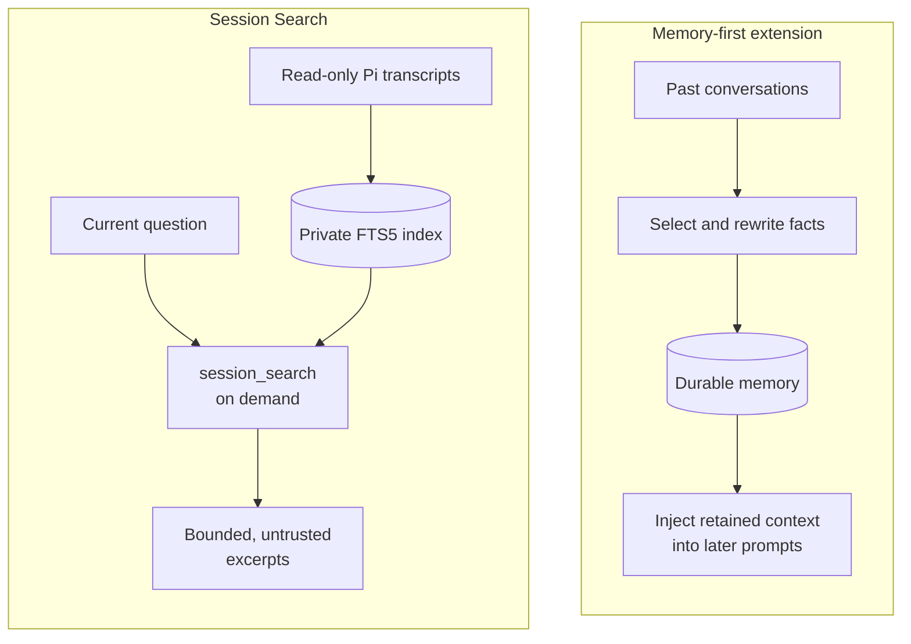
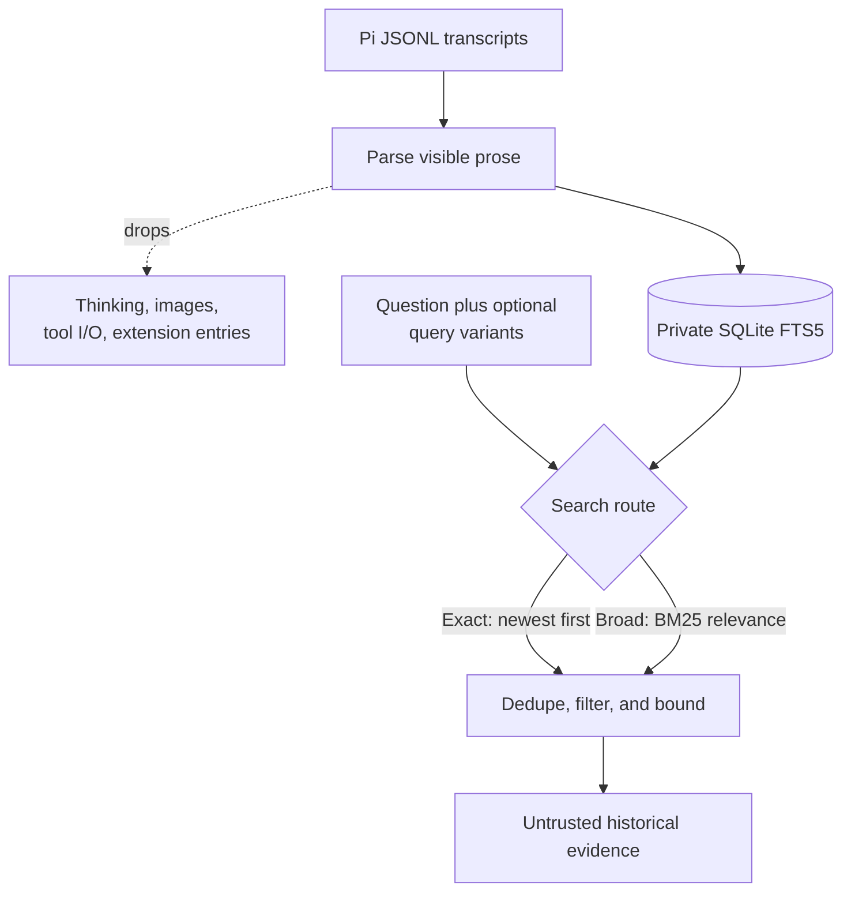

<p align="center">
  <picture>
    <source media="(prefers-color-scheme: dark)" srcset="docs/assets/session-search-title-dark.svg">
    <source media="(prefers-color-scheme: light)" srcset="docs/assets/session-search-title-light.svg">
    
  </picture>
</p>

<p align="center">🇬🇧 <b>English</b> &nbsp;·&nbsp; 🇪🇸 <a href="README.es.md">Español</a></p>

# Pi Session Search

**Why inject memory into every Pi session when you can search history on demand?**

Memory-first extensions solve a real but different problem. They preserve
selected facts, preferences, summaries, or instructions for future work. That
is useful when the retained material should influence every relevant session.
It is a poor default when you only want to answer questions such as "What did
we decide about the migration?" or "Where did we fix this before?"

Your agent should not carry unrelated history into every new task.

Persistent memory has to decide what deserves to survive, keep that material
current, and decide when to place it back into the prompt. A bad decision at any
of those steps can spend context on unrelated facts, carry stale conclusions
into new work, or make old conversation text look like a current instruction.
Larger memory stores also consume prompt space before the agent has established
that the current task needs them.

Session Search takes the narrower approach. It creates no durable memories,
context banks, generated skills, or automatic context injection. It builds a
private, rebuildable SQLite FTS5 index from visible prose in local Pi JSONL
transcripts. The transcripts remain read-only and authoritative.

An index is not context. Historical text reaches the model only when the agent
calls `session_search`, and every result is bounded and labeled as untrusted
historical evidence.

### Two ways to reuse history



Memory-first tools can make retained material part of future prompts before the
current task proves it is relevant. Session Search keeps transcripts and the
index outside the prompt until the agent asks for specific evidence.

| | Memory-first extensions | Session Search |
|---|---|---|
| Main job | Carry selected knowledge into future work | Retrieve evidence from past conversations when requested |
| Prompt behavior | May add retained material proactively | Adds nothing until `session_search` runs |
| Stored representation | Durable facts, summaries, preferences, or instructions | Rebuildable lexical index of transcript prose |
| Source of truth | A curated memory layer that must stay current | Original read-only Pi transcripts |
| Recall scope | What the memory process chose to retain | Indexed user, assistant, and system prose |
| Result control | Depends on the memory injection policy | Project, role, date, result-count, snippet, and output limits |

This makes Session Search the better default for conversation recall. You get
the useful part, finding what happened before, without turning every past
conversation into standing context for the next one.

### From transcript to bounded evidence



The extension writes only its rebuildable index. It does not rewrite source
transcripts, create memories, call a translation service, or add search results
to the prompt without a `session_search` call.

The boundary is enforced in code. Thinking blocks, images, tool arguments, tool
results, and extension entries stay out of the index. A call returns at most 20
results, limits each excerpt to between 100 and 4,000 characters, and caps total
output at 50 KiB. Exact matches keep newest-first ordering. Broader lexical
fallback uses FTS5 BM25 relevance. The agent may also supply up to three
source-language translations or keyword paraphrases, but Session Search makes
no translation, network, or additional model call.

On a frozen private corpus of 528 valid sessions and 9,023 visible messages,
Session Search reached 92.5% Rank@1 and 100% Recall@10 across 40 deterministic
known-item queries. Persistent-engine p95 latency was 1.16 ms. See
[docs/benchmark.md](docs/benchmark.md) for the methodology and limitations.

## Runtime contract

- `session_search` searches bounded historical snippets.
- `queryVariants` accepts up to three agent-supplied source-language
  translations or keyword paraphrases. Variants are searched first and results
  are interleaved and deduplicated by session.
- `/session-index` reconciles and incrementally updates the local index.
- Startup performs a bounded incremental backfill.
- Live indexing follows finalized messages.
- Shutdown flushes pending indexing and closes SQLite.
- Transcript results are marked as untrusted historical evidence.

Indexed by default:

- user prose
- visible assistant prose
- system prose
- project, cwd, timestamp, role, and tool names as metadata

Excluded by default:

- thinking blocks
- images and base64
- tool arguments and tool results
- extension custom entries

## Install

Install Pi Session Search from npm:

```bash
pi install npm:@felores/pi-session-search
```

Restart Pi or run `/reload`, then build the initial index:

```text
/session-index
```

Ask Pi about earlier conversations normally. The agent can call
`session_search` with optional source-language `queryVariants` when the current
question and the historical conversation may use different languages.

The extension reads Pi JSONL transcripts without modifying them. Generated
state stays in `~/.pi/agent/session-search/` with private filesystem modes.

## Local development

```bash
npm install
npm run hooks:install # optional contributor hook
npm run quality
pi -e ./src/index.ts
```

Generated state defaults to `~/.pi/agent/session-search/index.sqlite`. Override
the storage directory with `PI_SESSION_SEARCH_DIR` and the transcript root with
`PI_CODING_AGENT_SESSION_DIR`.

Do not enable Session Search globally alongside another extension that already
registers `session_search`; Pi will suffix duplicate tool and command names.
During migration, validate this checkout with `pi -e ./src/index.ts` and switch
the global package only after the replacement index passes its gates.

## Status

The first release supports Pi JSONL sessions. The normalized source boundary is
reserved for a later read-only OpenCode SQLite adapter.

## License and origin

MIT. Parts of the parser and search behavior are derived from
[`pi-hermes-memory`](https://github.com/chandra447/pi-hermes-memory). See
[ATTRIBUTION.md](ATTRIBUTION.md).
